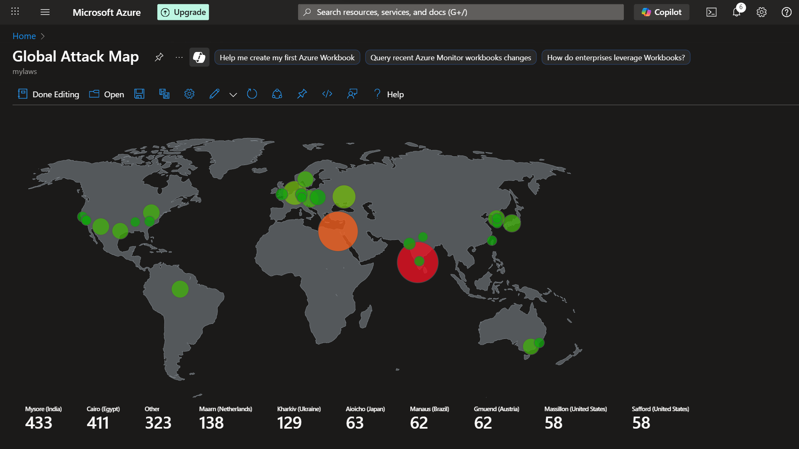

# Global Attack Research Project

This project documents a cybersecurity experiment involving exposing an Ubuntu VM in an isolated Azure environment to study real-world attack behaviors. Logs were ingested into Azure Sentinel and analyzed using Kusto Query Language (KQL) to detect threats and map global attack sources.

---

## Overview

- Deployed and exposed an Ubuntu VM to attract attack traffic.
- Streamed logs to Azure Sentinel for centralized monitoring.
- Used KQL to analyze attack data and identify attacker locations globally.
- Created an interactive global attack map using Azure Workbooks.

---

## Repository Structure

- `deployment/` - Infrastructure deployment templates and setup instructions.
- `kql-queries/` - KQL scripts for detecting attacks and visualizing data.
- `screenshots/` - Dashboards and attack map visuals.
- `notes/` - Findings, observations, and mitigation strategies.

---

## What I Did

1. Deployed and exposed an Ubuntu VM on Azure.
2. Configured Azure Sentinel to collect logs from the VM.
3. Wrote KQL queries to detect brute-force attacks, vulnerability scans, and visualize attacker geography.
4. Created a global attack map workbook for visual insight into attack sources.

---

## Key Findings

- The VM was targeted by SSH brute-force attempts within minutes of exposure.
- Attackers primarily came from Asia, Eastern Europe, and South America.
- Botnet activity targeted default usernames and ports.
- Attempts were made to exploit vulnerabilities CVE-2021-41773 and CVE-2022-0847 (“Dirty Pipe”).
- Attack traffic peaked during specific UTC time windows, suggesting botnet cycles.

---

## Takeaways

- Any internet-exposed system is immediately targeted.
- Continuous real-time monitoring with SIEMs like Azure Sentinel is essential.
- Visualizing attack sources aids understanding attacker behavior and improves defense.

---

## How to Use

1. Follow deployment instructions in `deployment/setup-instructions.md` to recreate the environment.
2. Import KQL queries from `kql-queries/` into Azure Sentinel.
3. Import the global attack map workbook JSON.
4. Review findings and mitigation notes in `notes/`.

---

## Screenshots

---

## License

MIT License

---

## Contact

Feel free to reach out for questions or collaboration.
https://www.linkedin.com/in/amit29533/
